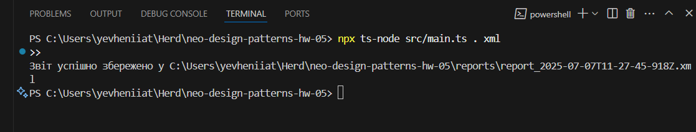

# File System Report CLI Utility

Цей проєкт реалізує консольну утиліту для аналізу файлової системи та генерації звітів у форматах JSON, CSV та XML за допомогою структурних патернів **Facade** і **Adapter**.

## Структура проєкту

```
neo-design-patterns-hw-05/
├─ node_modules/ # Залежності (ігнорується .gitignore)
├─ reports/ # Генеровані звіти
├─ src/
│ ├─ adapters/ # Адаптери форматування (JSON, CSV, XML)
│ │ ├─ JsonReportAdapter.ts
│ │ ├─ CsvReportAdapter.ts
│ │ └─ XmlReportAdapter.ts
│ ├─ app/
│ │ └─ ReportManager.ts # Високорівневий фасад (менеджер звітів)
│ ├─ core/
│ │ ├─ DirectoryReport.ts # Інтерфейс результату аналізу
│ │ ├─ DirectoryAnalyzer.ts # Логіка обходу директорії
│ │ ├─ ReportAdapter.ts # Інтерфейс адаптера формату
│ │ └─ AnalyzerFacade.ts # Низькорівневий фасад (аналіз + адаптація)
│ └─ main.ts # Точка входу CLI
├─ .gitignore # Ігнорує node_modules, вихідні файли тощо
├─ package.json # NPM залежності та скрипти
├─ tsconfig.json # Налаштування TypeScript
└─ README.md # Опис та інструкції
```

## Використані патерни

- **Facade** — дво-рівнева ієрархія фасадів (`AnalyzerFacade` та `ReportManager`), що спрощує взаємодію із складною системою аналізу та збереження.
- **Adapter** — окремі класи-адаптери (`JsonReportAdapter`, `CsvReportAdapter`, `XmlReportAdapter`) забезпечують уніфікований контракт для форматування звіту.

## Інструкція запуску

1. Встановіть залежності:
   ```bash
   npm install
   ```
2. Запустіть утиліту з аргументами: шлях до директорії та формат (за замовчуванням: поточна папка, формат json):
```bash
# Аналіз поточної папки, формат JSON
npx ts-node src/main.ts . json

# Аналіз вказаної папки, формат XML
npx ts-node src/main.ts path/to/dir xml

# Аналіз іншої папки, формат CSV
npx ts-node src/main.ts ./reports csv
```

3. Результат буде записано у папку reports/ з іменем report_<timestamp>.<format>.




# Домашнє завдання до Теми Структурні патерни: Адаптер та Фасад

### Опис завдання

Мета домашнього завдання — опанувати застосування структурних патернів у реальному контексті, а саме:

- Фасад (Facade) — для спрощення складного процесу аналізу і побудови звіту;
- Адаптер (Adapter) — для уніфікації форматів виводу звіту.

Наше домашнє завдання моделює ситуацію зі створення справжньої інструментальної утиліти, яка зустрічається у проектах з CLI-архітектурою.

Реалізуйте консольну утиліту для аналізу файлової системи, яка:

- виконує повний аналіз обраної директорії;
- генерує звіт про її вміст;
- зберігає цей звіт у форматі `JSON`, `CSV` або `XML` залежно від обраного режиму;
- демонструє поєднання двох структурних патернів: Адаптер і Фасад;
- застосовує ієрархію фасадів: високорівневий фасад керує низькорівневим.

Архітектурні особливості застосунку наступні.

- Застосунок має два ієрархічні фасади:
  - `ReportManager` — високорівневий фасад, керує всім життєвим циклом;
  - `AnalyzerFacade` — низькорівневий фасад, координує аналіз і форматування;
- Патерн Адаптер дозволяє підключати нові формати без зміни вже написаної логіки застосунку;
- Розділення обов’язків — кожен компонент відповідає лише за свою зону.

### Патерни проектування

#### 1. Патерн "Фасад"

У проекті реалізовано два рівні фасадів:

1. **AnalyzerFacade** (низькорівневий фасад):

   - Приховує складність роботи з DirectoryAnalyzer
   - Координує взаємодію між аналізатором та адаптером
   - Надає простий метод generateReport()

2. **ReportManager** (високорівневий фасад):
   - Приховує роботу з AnalyzerFacade
   - Керує вибором адаптерів
   - Займається файловою системою
   - Обробляє помилки
   - Форматує імена файлів

#### 2. Патерн "Адаптер"

Реалізовано через інтерфейс ReportAdapter з трьома конкретними реалізаціями:

- JsonReportAdapter
- XmlReportAdapter
- CsvReportAdapter

### Структура файлів

```
├── DirectoryReport.ts    # Інтерфейс звіту
├── DirectoryAnalyzer.ts  # Аналіз директорій
├── ReportAdapter.ts      # Інтерфейс адаптера
├── JsonReportAdapter.ts  # Адаптер для JSON
├── XmlReportAdapter.ts   # Адаптер для XML
├── CsvReportAdapter.ts   # Адаптер для CSV
├── AnalyzerFacade.ts     # Низькорівневий фасад
├── ReportManager.ts      # Високорівневий фасад
└── main.ts              # Точка входу
```

## Встановлення та запуск

1. Встановіть залежності:

```bash
npm install
```

2. Запустіть аналіз:

```bash
# Аналіз поточної директорії з виводом у JSON (за замовчуванням)
npm start

# Аналіз вказаної директорії
npm start ./path/to/directory

# Аналіз з вказаним форматом (json, xml, csv)
npm start ./path/to/directory json
npm start ./path/to/directory xml
npm start ./path/to/directory csv
```

## Результати

Звіти зберігаються в директорії `reports` з іменами виду:

- `report-2024-02-20T12-34-56-789Z.json`
- `report-2024-02-20T12-34-56-789Z.xml`
- `report-2024-02-20T12-34-56-789Z.csv`

Кожен звіт містить:

- Кількість файлів
- Кількість директорій
- Загальний розмір файлів
- Статистику по розширеннях файлів
